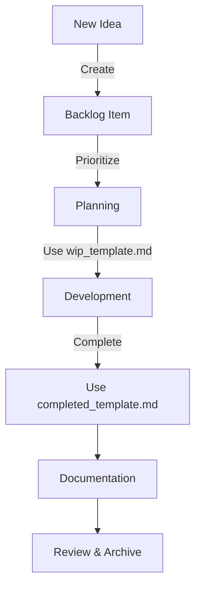

# SmartChat Sales Enablement - Project Management Guide

## Table of Contents
- [Project Structure](#project-structure)
- [Workflow](#workflow)
- [Documentation Standards](#documentation-standards)
- [Version Control](#version-control)
- [AI Collaboration](#ai-collaboration)
- [Quality Assurance](#quality-assurance)
- [Templates & Examples](#templates--examples)
- [Best Practices](#best-practices)

## Introduction

Welcome to the SmartChat Sales Enablement project management guide. This document provides a structured approach to managing our development process, ensuring consistency, quality, and effective collaboration between team members and AI assistants.

Whether you're working on new features, fixing bugs, or improving documentation, this guide will help you navigate our project structure and processes.

## Project Structure

Our project follows a well-organized directory structure to maintain clarity and consistency. Here's how it's structured:

```
plans/
├── 0_backlog/           # New ideas and feature requests
├── 1_planning/          # Upcoming versions being planned
│   └── Vx.x.x/         # Version-specific planning
│       ├── README.md    # Version overview
│       ├── design.md    # Technical design decisions
│       ├── spec.md      # Detailed specifications
│       └── ai_prompts_log.md  # AI interaction history
├── 2_inprogress/        # Features currently in development
├── 3_completed/         # Completed versions
├── _reference/          # Documentation and references
└── _templates/          # Standard templates
```

### 1. Backlog (`0_backlog/`)
- **Purpose**: Capture all new ideas, feature requests, and enhancements
- **Process**:
  - Create a new markdown file for each idea
  - Include problem statement, proposed solution, and potential impact
  - Tag with priority (P0-P3) and estimated effort (S/M/L/XL)
  - Review during weekly planning meetings

### 2. Planning (`1_planning/`)
- **Version Folders**: Each version follows semantic versioning (e.g., V1.2.3)
- **Required Files**:
  - `README.md`: Version overview and goals
  - `design.md`: Technical architecture and decisions
  - `spec.md`: Detailed requirements and acceptance criteria
  - `ai_prompts_log.md`: Record of AI interactions

### 3. In Progress (`2_inprogress/`)
- **Purpose**: Track active development work
- **Guidelines**:
  - Create a branch for each feature/fix
  - Reference the planning documents
  - Update status regularly

### 4. Completed Work (`3_completed/`)
- **Purpose**: Archive of completed work
- **Included for each version**:
  - Final documentation
  - Test results
  - Retrospective notes
  - Deployment artifacts

---

## Documentation Standards

### Version Planning (`README.md`)
- **Purpose**: High-level overview of the version
- **Sections**:
  - Executive summary
  - Business objectives
  - Success metrics
  - Timeline and milestones
  - Dependencies and risks
  - Team members and roles

### Technical Design (`design.md`)
- **Purpose**: Technical blueprint for implementation
- **Sections**:
  - System architecture
  - Data models and flows
  - API specifications
  - Security considerations
  - Performance requirements
  - Deployment architecture
  - Technical debt and trade-offs

### Specifications (`spec.md`)
- **Purpose**: Detailed requirements and acceptance criteria
- **Sections**:
  - User stories with acceptance criteria
  - Functional requirements
  - Non-functional requirements
  - Test scenarios and edge cases
  - Performance benchmarks
  - Rollback procedures

## Version Control

### Branch Naming Conventions
- `feature/` - New features (e.g., `feature/user-authentication`)
- `fix/` - Bug fixes (e.g., `fix/login-validation`)
- `docs/` - Documentation updates
- `chore/` - Maintenance tasks
- `release/` - Release preparation

### Commit Message Format
Follow [Conventional Commits](https://www.conventionalcommits.org/):
```
<type>[optional scope]: <description>

[optional body]

[optional footer(s)]
```

**Types**:
- `feat`: New feature
- `fix`: Bug fix
- `docs`: Documentation changes
- `style`: Code style changes
- `refactor`: Code changes that neither fix a bug nor add a feature
- `perf`: Performance improvements
- `test`: Adding tests
- `chore`: Changes to the build process or auxiliary tools

## AI Collaboration

### Prompt Management
- **File**: `ai_prompts_log.md` in each version directory
- **What to log**:
  - Initial prompts and refinements
  - Key decisions and rationale
  - Successful patterns and anti-patterns
  - Context and constraints provided

### Best Practices
1. **Be Specific**
   - Clearly define the task
   - Provide necessary context
   - Specify the desired output format

2. **Iterative Refinement**
   - Start with high-level prompts
   - Refine based on outputs
   - Document iterations

3. **Security**
   - Never include sensitive data
   - Review outputs for security implications
   - Follow data handling guidelines

## Quality Assurance

### Testing Strategy
- **Unit Tests**: Test individual components in isolation
- **Integration Tests**: Verify component interactions
- **E2E Tests**: Validate complete user flows
- **Performance Tests**: Ensure system meets performance requirements

### Code Review Process
1. **Pre-Submit**
   - Self-review your changes
   - Run all relevant tests
   - Update documentation

2. **Review Request**
   - Assign appropriate reviewers
   - Provide context and testing details
   - Link related issues

3. **Review Guidelines**
   - Check for correctness and completeness
   - Verify test coverage
   - Ensure code style consistency
   - Consider security implications

## Workflow

### 3.1. Idea Capture (Backlog)
- All new ideas, feature requests, and enhancements are first documented in `0_backlog/`.
- Ideas are reviewed and prioritized during planning cycles.

### 3.2. Planning
- Selected features are moved to `1_planning/`, organized by target version.
- Each planned version receives detailed documentation:
  - **Design**: System architecture, UX/UI, data flow, and technical decisions
  - **Specification**: Functional and non-functional requirements, test cases, and success criteria

### 3.3. In Progress
- Features under active development may be tracked in `2_inprogress/` (if used).
- This stage supports coordination between team members and helps avoid duplication or conflicts.

### 3.4. Completion & Archiving
- Upon completion, all documentation and artifacts are moved to `3_completed/` under the relevant version.
- A summary and any lessons learned, architecture reviews, or scripts are included for future reference.

### 3.5. Reference & Templates
- The `_reference/` directory provides quick access to logs and methodology.
- The `_templates/` directory ensures all documentation follows a consistent structure, making onboarding and audits easier.

---

## Templates & Examples

### Available Templates

#### 1. Work in Progress (WIP) Template
**Location:** `_templates/wip_template.md`  
**When to Use:** When starting work on a new feature or enhancement  
**Purpose:** Guides the planning and documentation of new features from ideation to implementation-ready state

**Key Components:**
- Feature identification and naming
- Requirements gathering
- Design considerations
- Implementation planning

#### 2. Completed Feature Template
**Location:** `_templates/completed_template.md`  
**When to Use:** When a feature is completed and ready for review  
**Purpose:** Documents the completed feature for knowledge sharing and future reference

**Key Components:**
- Feature summary
- Implementation details
- Testing results
- Architecture impact

### How to Use the Templates

1. **For New Features:**
   - Copy `wip_template.md` to your version folder in `1_planning/`
   - Follow the template's instructions to document the feature
   - Move to `2_inprogress/` when development starts
   - Upon completion, use `completed_template.md` to document the final state

2. **For Quick Reference:**
   - Use the templates as checklists to ensure all aspects are covered
   - Customize sections as needed for your specific feature

### Example Workflow



### Template Maintenance
- Templates are living documents - suggest improvements as needed
- Keep templates in sync with this guide
- Document any customizations in the template's header

## Best Practices

### For Developers
- Write self-documenting code
- Keep commits small and focused
- Write tests before implementation (TDD)
- Document assumptions and decisions
- Review your own code before submitting

### For Documentation
- Keep it up to date
- Use consistent formatting
- Include examples
- Link to related resources
- Make it searchable

### For Collaboration
- Communicate early and often
- Be specific in feedback
- Assume positive intent
- Document decisions
- Share knowledge

## Troubleshooting

### Common Issues
1. **Merge Conflicts**
   - Pull latest changes frequently
   - Use `git rebase` to keep history clean
   - Resolve conflicts carefully

2. **Build Failures**
   - Check error messages
   - Verify dependencies
   - Ensure environment consistency

3. **Test Failures**
   - Reproduce locally
   - Check for environmental differences
   - Review recent changes

## Glossary

- **Sprint**: A time-boxed development cycle (typically 2 weeks)
- **Epic**: A large body of work that can be broken down into smaller stories
- **User Story**: A requirement expressed from the user's perspective
- **Technical Debt**: The implied cost of additional rework caused by choosing an easy solution now instead of a better approach
- **CI/CD**: Continuous Integration/Continuous Deployment

## 7. Applicability

This method is suitable for:
- AI/ML projects with evolving requirements
- Software teams needing lightweight but rigorous process
- Startups and research teams balancing speed and documentation

It can be adapted for more formal methodologies (e.g., Scrum, Kanban) or used as a standalone lightweight process.

---

## 8. Conclusion

A structured, versioned, and template-driven approach to project management supports clarity, agility, and long-term knowledge retention, making it ideal for fast-moving AI and software projects.
